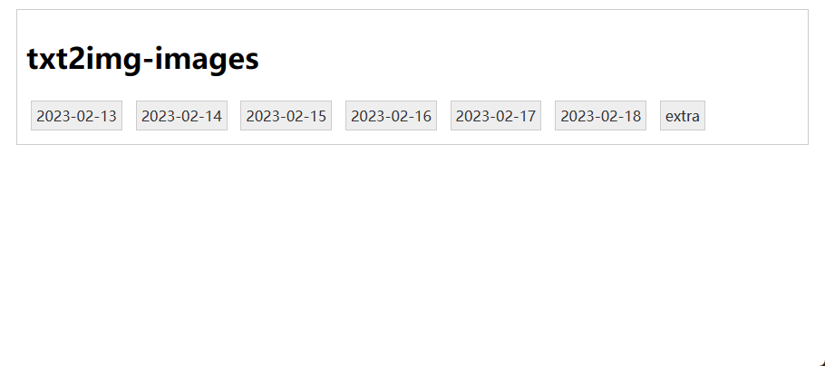
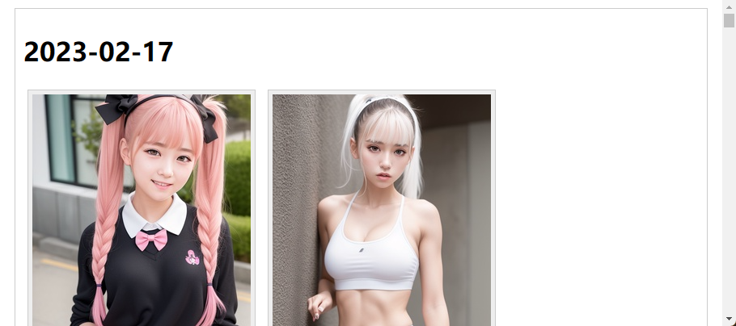

# Image Gallery Server

Start a server and serve all image files, all folders are rendered as button

## Usage

```shell
./image_gallery_server -dir <dir> -port 8080
```

## Screenshots





## Credits

Part of code is generated by ChatGPT, I fixed bugs and modified.
